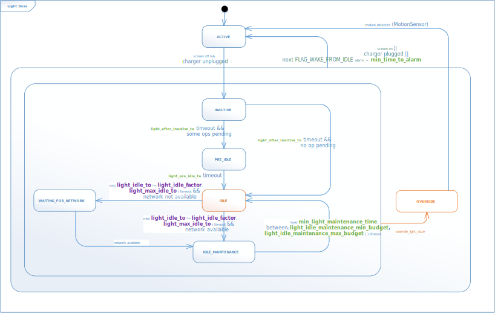

# doze-tweak

Understand **device idle state** transition and tune ```device_idle_constants``` settings properly!

## Prerequisite 

 - Android 6+ with [Doze](https://developer.android.com/training/monitoring-device-state/doze-standby.html)
 - [adb](https://developer.android.com/studio/command-line/adb.html)

## Goal

 - understand Doze internal [implementation](https://github.com/aosp-mirror/platform_frameworks_base/blob/nougat-release/services/core/java/com/android/server/DeviceIdleController.java)
 - tune ```device_idle_constants``` settings for usual phones to use Doze in a flexibel way
   - ```device_idle_constants_watch``` for wearable watches
 - without installing extra Apps
 - root access only for setup

## Caveat

 - Original Doze (or Deep Doze) available on Android 6+ and Light Doze only on Android 7+.
 - Deep Doze would only work if there is any motion sensor available (fallback on [significant motion sensor](https://github.com/aosp-mirror/platform_frameworks_base/blob/nougat-release/services/core/java/com/android/server/DeviceIdleController.java#L1379))
   - Older phone without such motion sensor (e.g. SMD) cannot be benefited from Deep Doze.
   - Some battery saving Apps would disable (i.e. actually [restrict](https://android.googlesource.com/platform/frameworks/native/+/nougat-release/services/sensorservice/SensorService.h#119)) sensors to other Apps, but Deep Doze will still have to [depend](https://github.com/aosp-mirror/platform_frameworks_base/blob/nougat-release/services/core/java/com/android/server/DeviceIdleController.java#L2248) on motion sensors.
 - Deep Doze' idle may have more impact than Light one (e.g. [UsageStatsService](https://github.com/aosp-mirror/platform_frameworks_base/blob/nougat-release/services/usage/java/com/android/server/usage/UsageStatsService.java#L527)).
 - tuning Doze settings from external ```adb``` interface is not very convenient in case that you want to change them frequently and directly on your Android.
 - To prevent Google Service to reset ```device_idle_constants```: [Solution](https://forum.xda-developers.com/android/apps-games/root-doze-settings-editor-android-t3235130/page144)
 ```
  2 methods:
  sqlite3 /data/data/com.google.android.gms/databases/phenotype.db "DELETE FROM Flags WHERE name = 'device_idle_constants';"
  or
  pm disable --user 0 com.google.android.gms/.phenotype.service.sync.PhenotypeConfigurator
 ```
 
[Here](https://medium.com/@tsungi/android-doze-tweaks-83dadb5b4a9a) is more background and detail.

## Usage & Example

Inspect current Doze settings from ```deviceidle```
```
$ adb shell dumpsys deviceidle
  Settings:
    light_after_inactive_to=+5m0s0ms
    light_pre_idle_to=+10m0s0ms
    light_idle_to=+5m0s0ms
    light_idle_factor=2.0
    light_max_idle_to=+15m0s0ms
    light_idle_maintenance_min_budget=+1m0s0ms
    light_idle_maintenance_max_budget=+5m0s0ms
    min_light_maintenance_time=+5s0ms
    min_deep_maintenance_time=+30s0ms
    inactive_to=+30m0s0ms
    sensing_to=+4m0s0ms
    locating_to=+30s0ms
    ...
```
Inspect any customized Doze settings. It returns ```null``` if none has been set.
```
$ adb shell settings get global device_idle_constants
null
```
Configure customized Doze settings.

To ignore Deep Doze and discard any motion by increasing ```inactive_to``` (and ```motion_inactive_to```) timeout to a very large number (e.g. 30 days) so that Deep Doze never goes into its IDLE state and only Light Doze can manage to its IDLE state. 
```
$ adb shell settings put global device_idle_constants inactive_to=2592000000,motion_inactive_to=2592000000
```

To ignore Light Doze for whatever reason by doing similar setup with ```light_after_inactive_to``` so that Light Doze probably never enters IDLE state.
```
$ adb shell settings put global device_idle_constants light_after_inactive_to=2592000000
```

To ignore Deep Doze and use Light Doze mimic Deep Doze timing.
```
$ adb shell settings put global device_idle_constants inactive_to=2592000000,motion_inactive_to=2592000000,light_after_inactive_to=3000000,light_max_idle_to=21600000,light_idle_to=3600000,light_idle_maintenance_max_budget=600000,min_light_maintenance_time=30000
```

To idle as much as possible without taking motion into account by ignoring the real Deep Doze and tuning Light Doze so that it will be trapped in IDLE state as long as possible. Maintenance task would be performed about twice a day for maximal 30 seconds and any alarm allowed to wake up Doze from idle would take less effect.
```
$ adb shell settings put global device_idle_constants inactive_to=2592000000,motion_inactive_to=2592000000,light_after_inactive_to=15000,light_pre_idle_to=30000,light_max_idle_to=86400000,light_idle_to=43200000,light_idle_maintenance_max_budget=30000,min_time_to_alarm=60000
```

Reset customized Doze settings to default.
```
$ adb shell settings delete global device_idle_constants
```

## Doze Device Idle State Transition

 - Actually there are two state machines running in parallel 
 - In any **IDLE** state the Doze mode is active and battery usaage gets reduced. 
 



